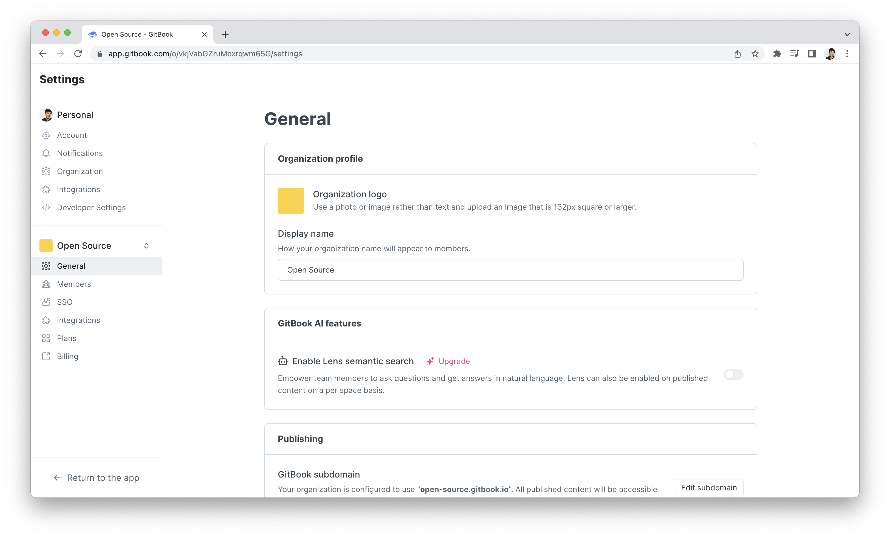

# Organizations

<figure><figcaption></figcaption></figure>


[https://api.gitbook.com/openapi.json](https://api.gitbook.com/openapi.json)



[https://api.gitbook.com/openapi.json](https://api.gitbook.com/openapi.json)



[https://api.gitbook.com/openapi.json](https://api.gitbook.com/openapi.json)



[https://api.gitbook.com/openapi.json](https://api.gitbook.com/openapi.json)

