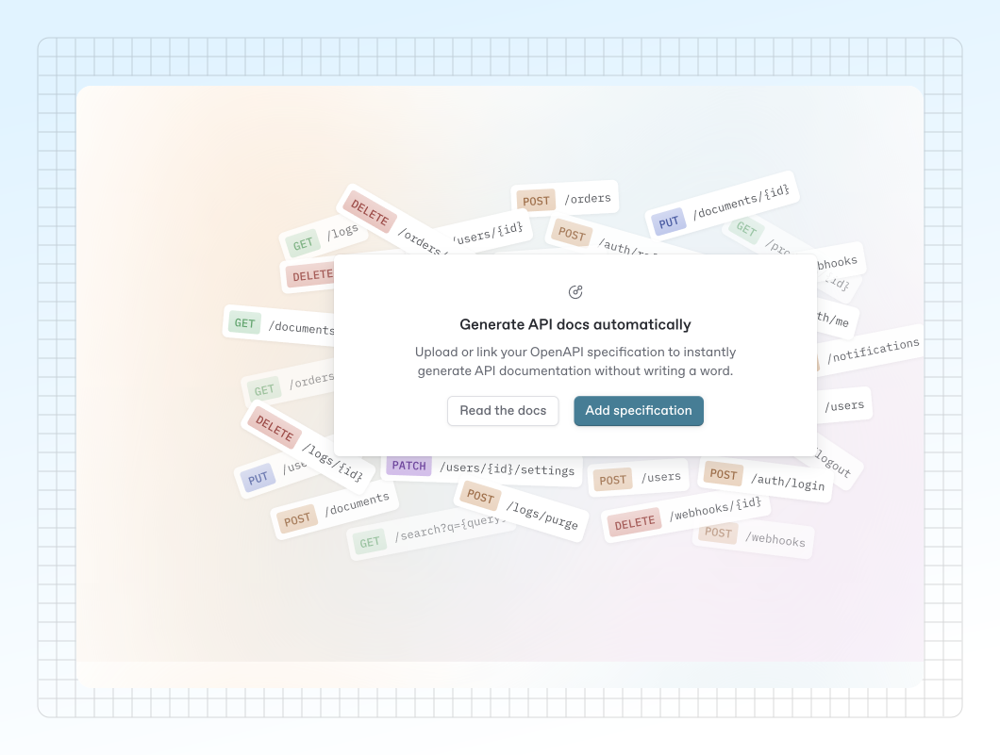

# Page 2

<figure><figcaption><p>this is a caption</p></figcaption></figure>



```swift
let context = ContextManager.instantContext(flowName: "upsell_onboarding", duration: 3)
if context.shouldUpsell {
    let vc = MyPremiumOfferViewController()
    vc.userDidPurchase = { product in
        context.logRevenueOutcome(from: product)
    }
    vc.userDidDismiss = {
        context.log(.negative)
    }
    present(vc, animated: true)
} else {
    context.log(.skipped)
}
```


