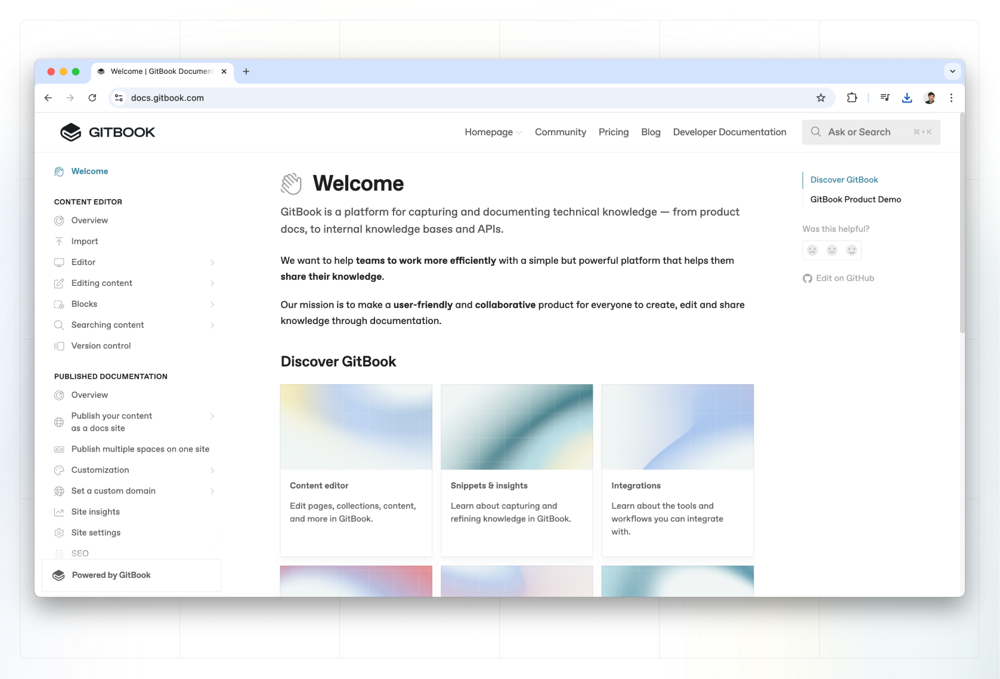

# Overview

When you’re ready to share your work, you’re able to publish your content so others can view and interact with the things you’ve created.

<figure><figcaption>
second
</figcaption></figure>

<figure><figcaption></figcaption></figure>

Below we’ll explain how to publish your content as a docs site, and invite teammates and users to collaborate on editing your content.

<figure><figcaption>
Published GitBook site
</figcaption></figure>

### Learn more

<figure><figcaption></figcaption></figure>

<table data-card-size="large" data-view="cards"><thead><tr><th></th><th></th><th data-hidden data-card-target data-type="content-ref"></th><th data-hidden data-card-cover data-type="files"></th></tr></thead><tbody><tr><td><strong>Publish a docs site</strong></td><td>Publish your content to the web.</td><td><a href="published-documentation/publish-a-docs-site/">publish-a-docs-site</a></td><td><a href=".gitbook/assets/11.png">11.png</a></td></tr><tr><td><strong>Share your content</strong></td><td>Share your edits or invite others to collaborate.</td><td><a href="collaboration/share/">share</a></td><td><a href=".gitbook/assets/5 (1).png">5 (1).png</a></td></tr><tr><td><strong>Customization</strong></td><td>Customize the look and feel of your published content.</td><td><a href="published-documentation/customization/">customization</a></td><td><a href=".gitbook/assets/9 (1).png">9 (1).png</a></td></tr><tr><td><strong>Set a custom domain</strong></td><td>Set up a custom domain for your published content.</td><td><a href="published-documentation/custom-domain/">custom-domain</a></td><td><a href=".gitbook/assets/2 (1).png">2 (1).png</a></td></tr></tbody></table>
